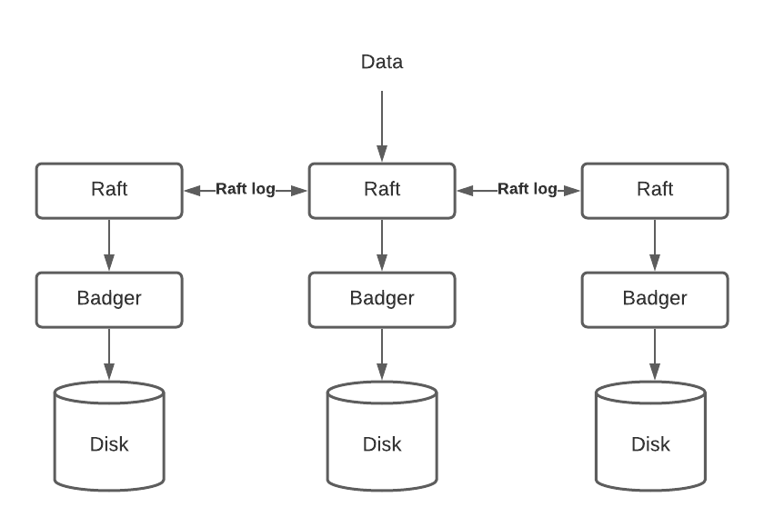

# TynamoDB

TynamoDB is a horizontally scalable, highly available, key-value storage service that is built with Raft consensus algorithms. This is a hobby project that help me understand Raft and build a distributed KV database. Raft is a distributed consensus algorithms that is designed to be easy to understandy. You may read more about Raft with [the extended Raft paper](https://raft.github.io/raft.pdf)

TynamoDB is mainly implemented based on [TinyKV](https://github.com/tidb-incubator/tinykv) and [MIT 6.824 Lab 2: Raft](http://nil.csail.mit.edu/6.824/2018/labs/lab-raft.html)

# Feature

**Highly Available**: build a fault tolerant KV server on top of Raft which is a distributed consensus algorithm so that the service will remain operational even when the minority of the servers fail.

**Eventual Consistency**: Logs are stored in the master, and replayed in order in the slaves. Every write request will wait until the majority of the servers to commit the write message before replying back to the client to ensure consistency.

# Fulat Tolerance

A replicated state machine implements fault tolerance by storing copies of its data on the remaining servers/nodes. By storing copies of data on multiple servers, the replicate state machine can continue to operate even if the minority of the servers fail, either due to server or network failures. 

For instance, when server A is communicating with server B, a crash in B is indistinguishable from a partition from A and B. From A's perspective, B becomes unreachable, experiencing timeouts or unable to receive messages from B. This could either due to B's hardware failure, or intermittent software failure, or network partition failure. 

Making a distributed system behave like a coherent unit in face of these failures can be a challenge, and that’s why we sometimes need a consensus algorithm, like `Raft`

To be able to cope with failure, Raft requires majority of the servers to be available. For instance, 2 servers must be available in a replica group of 3 servers. In a 5-server replica group, at least 3 server have to be available. 

The following diagram demonstrate a sample 3-server replica group implementation in TynamoDB. Requests come into raft layer first. Then data are replicated across other servers and persisteted through [Badger](https://github.com/dgraph-io/badger). If one of the server fails, the data can still be recovered from the remaining two servers.

To handle failures, Raft is divided into three sub sections:

- Leader election
- Log Replication
- Safety

You may read more about Raft with [the extended Raft paper](https://raft.github.io/raft.pdf)

# Implementing Eventual Consistency in TynamoDB with Raft

## Write Request: Strong Consistency
Raft is CP algorithms, meaning that Raft ensures consistency and can tolerate partition failure, but Raft may be unavailable for certain amount of time to do replicate data to majority of the servers and persist it before getting back to the client. Every write request will be handled by master to ensure consistency.

## Read Request: Eventual Consistency

In the original Raft implementation, clients only communicate with leader/master to ensure strong consistency.

TynamoDB achieves eventual consistency by allowing the client to read from all servers (including slaves) even if the data in the slaves may be outdated or incorrect, in a round-robin fashion.

The following flow demonstrate what a read request might look like in **TynamoDB**

### Scenario 1: Data is present and consistent across all replicas
Read request will randomly select one of the node in a round robin algorithms.

The client will receive the correct and consistent data from either slaves or master.

### Scenario 2: Data is inconsistent while Raft is the middle of recovering from failures

When the minority of the servers fail, client read request could either land on master or slave

**Master**: if the read request hit master when Raft is recovering from failure, the read request will wait until master replicate all of the logs/states in order in all slaves. In this case, read request may timeout few times before master replay all states in order.

**Slave**: if the read request hit slave when Raft is recovering from failure, the slave would return its local copy of the data back to client. This data maybe outdated version of the data. Read request should return immediately in this case

### Scenario 3: Data is present on master but not in slave

This scenario happens when a new data has just been written to master but has not yet been replicated to all the slaves.

**Master**: In this case, master should be able to return its local copy back to the client.

**Slave**: Since slave hasn't yet received copy from master, slave will return `KeyNotFound` error back to the client.

